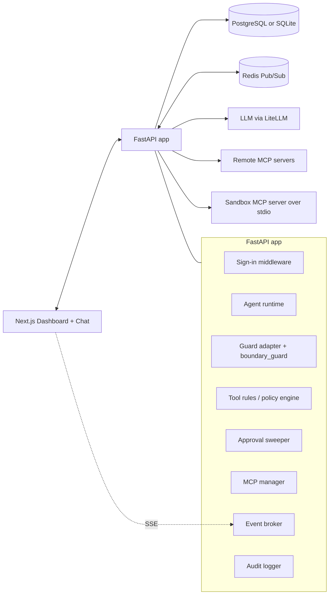

# Agent

How the agent in `apps/agent` works: the run loop, where the guard and the tool rules sit, approvals,
and what the user is told when something is stopped. The HTTP endpoints are in [API.md](API.md).

## Summary
- A guarded AI agent that discovers its tools from MCP servers at runtime.
- Two independent checks sit around the model:
  - the **guard** (`packages/guard`, adapted in `guarding.py`) checks *text* at four stages: the user's
    message, tool arguments, tool output and the final answer;
  - the **tool rules** (`policy.py`) decide each *tool call* by tool, server, arguments, budgets and run
    taint.
- Anything either one escalates waits for a person (an approval), with default deny on expiry.
- A Next.js dashboard (`apps/dashboard`) is the chat for users and the control plane for admins:
  guardrails, approvals, logs, tools and the playground.

## What We Are Solving
- Dynamic MCP tool discovery and execution.
- Checking user input, tool calls, tool output and answers for injection, secrets, PII, off-topic
  requests, toxicity and schema violations.
- Deterministic tool-call decisions before any tool runs, including after an approval.
- Live changes (guard modes, dashboard rules, tool rules) without a restart.
- Human approval for sensitive tool calls and for content the guard escalates.
- Approval invalidation when a re-check now blocks; automatic expiry with default deny.
- Token and cost budgets per conversation.
- An audit trail of every message, decision, approval and tool result, without storing raw secrets.

## What We Are Not Solving
- Enterprise identity: there is no SSO, multi-tenancy or per-resource permissions. Sign-in is two roles
  (`user`, `admin`) from a static account list (`AUTH_USERS`).
- Cryptographic intent verification.
- A general autonomous planning platform.
- Perfect detection of prompt injection: the guard reduces it; taint and approvals limit what a
  successful injection can do.
- Production-scale distributed orchestration.

## Core Principles
- The model proposes; the system decides what runs.
- Tools are discovered from MCP servers, never hard-coded in the runtime path.
- Decisions use structured intent (tool, arguments, run state) and guard verdicts, never the model's
  reasoning text.
- An approval is not lasting authority: the latest guard and tool rules are applied again before an
  approved call runs.
- Raw checked text is never stored or published by the guard: decision rows and events carry a
  redacted excerpt and a hash.
- The user gets a plain sentence; scores, policy ids and detector reasons go to the logs.

## Chosen Stack
- Frontend: Next.js.
- Backend: FastAPI.
- Database: PostgreSQL, or SQLite for local development (`DATABASE_URL`).
- Realtime: Redis pub/sub when `REDIS_URL` is set, else in-process queues; served to the dashboard over SSE.
- LLM: LiteLLM (`LLM_MODEL`, default `openai/gpt-4.1-mini`). Mock and stub planners exist for local demos
  only and need `ALLOW_DEMO_MOCK_PLANNER=true`.
- MCP servers seeded at start-up: `local-sandbox` (stdio, `apps/sandbox-mcp`), `exa` (remote, when
  `EXA_MCP_ENABLED`), and an optional remote server from `REMOTE_MCP_URL`.

## High-Level Design

## Main Runtime Flow

`AgentRuntime.handle_chat` (`agent.py`):

1. If the conversation already has a pending approval, no run starts; the response is
   `waiting_approval` with that approval's id.
2. A `Run` is created. **Guard: `user_input`.** The (possibly redacted) text is what gets stored, titled,
   logged, traced and sent to the model; the original is never stored.
3. If a secrets policy redacted something, the run stops with the **secret-withheld** reply (below).
4. If the guard blocked, the run stops with a block notice. If it escalated, the run pauses for a
   **content review**.
5. The planner loop runs up to `MAX_TOOL_STEPS` (default 6) times:
   1. Budgets are checked; an exhausted token or cost budget stops the run.
   2. The planner sees the user message, the last 12 conversation messages and the tool results so far.
      With `GUARD_SPOTLIGHT=true`, tool results are wrapped in per-call nonce markers and the model is
      told to treat them as data.
   3. If it answers, **guard: `final_output`** runs (with tool results as references, and the run's
      `response_schema` if any). Block: notice. Escalate: content review. Otherwise the (possibly
      redacted) answer completes the run.
   4. If it asks for a tool, budgets are checked again and the call goes through tool-call evaluation.
6. Reaching the step limit stops the run with `failed` and a `stopped` notice.

Tool-call evaluation (`_evaluate_tool_call`):

1. **Secret-placeholder refusal** (below), before anything else.
2. **Guard: `tool_args`** on the JSON arguments. Block *or* redact stops the call (arguments are never
   rewritten). Escalate marks the call as needing approval.
3. **Tool rules** (`PolicyEngine.evaluate`) with the live enabled policies. `block` stops the call;
   `require_approval` (or a guard escalation) creates a `tool_call` approval and pauses the run.
4. The MCP manager runs the tool. A failure ends the run as `failed`.
5. **Guard: `tool_output`** on the result text.
   - A taint policy firing (enforced or shadow) marks the run tainted.
   - Block: by default the result is replaced with a `withheld_by_guard` note and the loop continues
     (`GUARD_TOOL_OUTPUT_ON_BLOCK=continue`); with `halt`, the run stops.
   - Escalate: content review.
   - Redact: the result is rebuilt from the redacted text (the raw copy is dropped).
6. Only the guarded result is stored as a `tool` message, logged and given to the planner.

Run statuses: `running`, `completed`, `blocked`, `waiting_approval`, `denied`, `failed`.

## The Four Guard Stages

| Stage | Checked text | Shipped policies (`policies/guard.yaml`) | On block | On escalate |
|---|---|---|---|---|
| `user_input` | The user's message | injection (Prompt Guard; regex patterns in shadow), topic, secrets (redact), PII (redact) | Run stops, notice | Content review |
| `tool_args` | Tool arguments as JSON | secrets egress, PII egress (block) | Call stops (redact also stops it) | Tool-call approval |
| `tool_output` | The tool's result text | injection (ProtectAI and heuristic, both shadow; they taint), secrets, PII (redact) | Result withheld, run continues (or halts) | Content review |
| `final_output` | The model's answer | secrets, PII (redact), `research_note` schema, toxicity; groundedness (async, shadow, flag) | Answer withheld, notice | Content review |

Operators add rules on top from the dashboard (`rules.py`, policy ids `rule_<slug>`); they run in the same
pipeline. Each policy is `off`, `shadow` (decision logged, not applied) or `enforce`. Every check writes one
`guard_decisions` row per policy and a `guard.decision` audit event; async policies' decisions arrive
later through `GuardDecisionSink`. The playground's scans and the start-up warm-up are not stored.

## Run Taint

When a tool-output policy that detects one of `GUARD_TAINT_LABELS` (default `injection`) fires, in enforce
*or* shadow mode, the run is marked `tainted` with a reason, and a `guard.run_tainted` event is logged.
Dashboard rules can opt in with `taints_run`.

Taint is acted on by `guard_signal` tool rules. On first start, two are seeded (unless
`SEED_GUARD_SIGNAL_POLICIES=false`): a tainted run needs approval for `write_file` and `delete_file`. So
an injection detector in shadow mode still gates writes, without blocking reads.

## Approvals

Two kinds, both stored in `approval_requests` with an `expires_at` of now + `APPROVAL_TTL_SECONDS`
(default 600):

| Kind | Created when | Approve | Deny |
|---|---|---|---|
| `tool_call` | A `require_approval` tool rule matches, or the guard escalates at `tool_args` | The call is re-evaluated (placeholder check, guard, current tool rules) and runs if still allowed; then the loop continues | Run `denied` |
| `content_review` | The guard escalates at `user_input`, `tool_output` or `final_output` | `user_input`: the loop starts on the held text. `tool_output`: the held content goes to the model. `final_output`: the answer is sent. | `user_input`: run `denied`. `tool_output`: a withheld note is given to the model and the loop continues. `final_output`: answer withheld, run `blocked`. |

- The held content is the guard's output, already redacted where a policy redacted it.
- If the re-check on approval blocks, the approval becomes `superseded` (`approval.invalidated` is logged
  when a tool rule caused it), and the user sees that the approved call was blocked.
- The approval stores the reviewer-facing reason (policy ids, scores). The user sees a plain line,
  stored on the run as `paused_reason`: "`<tool>` needs a person's approval before it runs", followed by
  the tool rule's reason when a tool rule asked (for a `guard_signal` rule, its reason without the taint
  detail); or "This needs a person's review before I can continue." for content reviews.
- Expiry: the approval sweeper (every `APPROVAL_SWEEPER_INTERVAL_SECONDS`, default 5) and the list and
  decision endpoints expire overdue approvals; the run becomes `denied` with "Approval expired before
  anyone reviewed it."

## Secrets: Withheld Stop and Placeholder Refusal

Secrets policies redact keys to placeholders such as `<OPENAI_KEY_1>`. The model never has the value, so
anything it "does with the key" would be wrong. Two checks prevent that:

- **Secret-withheld stop** (user input). If a secrets policy redacted the user's message and added new
  placeholders, the run stops before the planner with a fixed reply: the secret was removed, the
  assistant never saw it, nothing was done, add it yourself (e.g. in `.env`). If another policy also
  blocked or escalated, the reply adds "(It also didn't pass another safety check.)" without naming it.
  Logged as `guard.secret_withheld`. Placeholders the user merely quotes from earlier are not counted.
- **Secret-placeholder refusal** (tool arguments). If a tool call *assigns* a secret placeholder as a
  value (`OPENAI_API_KEY=<OPENAI_KEY_1>`, `"key": "{{openai_key_1}}"`, URL- or HTML-encoded forms), the
  call is refused before the guard and tool rules run, and nothing changes. A placeholder that is only
  mentioned passes. Active only while a secrets policy is enforcing. Logged as
  `guard.secret_placeholder_blocked`; a pending approval for that call becomes `superseded`.

When the planner prompt contains a placeholder, the model is also told not to write placeholders as
real values.

## What the User Is Told

`guarding.user_block_message` picks one sentence for a guard block, then appends
"(Reference: run `<first 8 chars of run id>`; details are in the logs.)":

1. The stopping policy's own `message`, if set. Dashboard rules always have one (default: "This was stopped
   by a rule your administrator set up."), so a rule's keywords are never shown.
2. At `user_input`, a sentence by what the policy detects, in the order secret, PII, injection/jailbreak,
   off-topic, toxicity.
3. At `tool_args`, when a secrets policy stopped it: "I stopped before running `<tool>` because it would
   have sent a secret."
4. Otherwise a sentence by stage (`tool_args`, `tool_output`, `final_output`).

Other user-facing lines come from the runtime: tool-rule blocks ("Tool call blocked: `<reason>`"), budget
stops, approval waits and denials, the step limit, tool failures and planner errors.

`withheld_result` (blocked tool output given to the model) names no policy or reason, since the model can
repeat what it is given.

## Message Notices

Assistant messages that are not answers carry `metadata.notice`, and the chat renders them as notices:

| `notice` | Set by |
|---|---|
| `blocked` | Any guard or tool-rule block, budget stop, secret-withheld stop, placeholder refusal, withheld answer after review, `user_input` review denied |
| `waiting` | A run paused for a `tool_call` approval or a content review |
| `stopped` | The step limit |

`ChatResponse.guard_notices` separately tells the user what was redacted from their own message
("Removed from your message before it was stored or sent to the model: `<OPENAI_KEY_1>` ..."). It is
returned with the response, not stored on a message.

## Components

### Agent Runtime (`agent.py`)
- Owns the loop above, run and conversation state, budgets, approvals and their resumption.
- Never runs a tool without the placeholder check, the `tool_args` guard and the tool rules, including
  on resume.

### Guard Adapter (`guarding.py`)
- Runs `boundary_guard` per stage, writes decision rows (redacted excerpt + sha256) and audit events,
  and works out taint.
- Knows which policies are secrets, sensitive (excerpts redacted) or taint policies; recomputed when the
  config hash changes (dashboard rules change the set at runtime).
- Builds user-facing messages and redacted or withheld tool results.

### Tool Rules (`policy.py`)
- Deterministic and separate from the guard. Input: a `ToolExecutionIntent` (tool, server, arguments,
  budgets and spend, run taint). Output: verdict, reason, user reason, matched rule ids, shadow verdicts.
- Rule types: `block_tool`, `require_approval`, `validate_args` (path prefixes or blocked values),
  `token_budget`, `cost_budget`, `guard_signal`.
- Precedence: `block` > `require_approval` > `allow`; then the more specific rule (server and/or tool
  scope); then higher priority. Never first-match-wins.
- Modes `off`, `shadow` (reported in `policy.decision` events, not applied), `enforce`.
- Paths are normalised as relative POSIX paths before prefix checks; absolute paths and escapes via `..`
  are rejected.

### MCP Manager (`mcp_manager.py`)
- Stores servers, connects over `stdio`, `sse` or `streamable_http`, discovers and caches tools.
- Seeds the default servers at start-up; credentials from `.env` are added at connect time and masked in
  API responses.

### Approval Sweeper (`startup.py`)
- Background task in the app lifespan; expires overdue approvals.

### Event Broker and Audit Logger (`realtime.py`, `audit.py`)
- Every audit event is stored in `audit_events` and published as `{type, payload}`; the dashboard
  listens on `/api/events/stream`.

### Sandbox MCP Server (`apps/sandbox-mcp`)
- A file workspace confined to its root: `list_files`, `read_file`, `write_file`, `delete_file`,
  `search_files`. Used to show blocks, approvals, path rules and taint.

## Code Layout

| File | Role |
|---|---|
| `main.py` | Assembles the FastAPI app: sign-in middleware, CORS (the dashboard origin and its localhost/127.0.0.1 twin), the routers and the playground router. |
| `services.py` | Runtime objects built once at import: settings, broker, audit logger, MCP manager, policy engine, telemetry, daily spend, rate limiter, authenticator, guard (if `GUARD_POLICY_PATH` is set), guard adapter, agent runtime. Read as `services.x` so tests can replace them. |
| `startup.py` | Lifespan: database, broker, seeded MCP servers and tool discovery, default taint rules, stored guard mode overrides and dashboard rules, guard warm-up (one check per stage), approval sweeper; drains the guard and flushes telemetry on shutdown. |
| `api/` | Routers: `auth` (middleware + login), `chat`, `approvals`, `guard`, `guard_rules`, `tool_policies`, `tools` (MCP), `logs`, `system`. |
| `playground.py` | Admin playground: guard scan and attack mode. |
| `agent.py`, `guarding.py`, `policy.py`, `rules.py` | Runtime loop, guard adapter, tool rules, dashboard guard rules. |
| `auth.py` | Accounts, tokens, `required_role`. |
| `llm.py` | Planners (LiteLLM, plus mock/stub for demos). |
| `models.py`, `db.py`, `migrations.py` | Database models and setup. |

## Key Design Choices

### Custom agent loop over an agent framework
- Keeps the guard and policy seams explicit and testable; no hidden framework behaviour.

### Guard and tool rules as separate layers
- The guard judges text (what was said, returned or written); the tool rules judge actions (what is about
  to run). Taint connects them: a guard signal on output changes what later calls need.

### Shadow before enforce
- Guard policies, dashboard rules and tool rules all have a shadow mode, so a new check's effect can be
  measured on real traffic (`/api/guard/stats`) before it acts.

### Live lookup on every decision
- Tool rules are read from the database on each call; guard modes and rules change the live guard in
  place. Dashboard changes apply without a restart and stale approvals cannot bypass them.

### SSE plus Redis pub/sub
- Live dashboard updates across workers when Redis is configured; in-process queues otherwise.

## Data Model
- `conversations` (owner, budgets, spend), `messages`, `runs` (status, tainted, paused reason, response
  schema)
- `mcp_servers`, `discovered_tools`
- `policies` (tool rules)
- `approval_requests` (kind, stage, status, expiry)
- `audit_events`
- `guard_decisions` (one row per policy per check), `guard_overrides` (mode changes to file policies),
  `guard_rules` (dashboard rules, versioned)
- `login_failures` (failed sign-ins per client address, for the throttle; pruned after 5 minutes)

## Edge-Case Stance
- MCP server failure mid-call: the run ends `failed` with the error; mutating tools are not retried.
- Prompt injection: guarded at input and tool output; tool output is spotlighted; taint gates writes.
- Rule conflicts: deterministic precedence.
- Approver offline: approvals expire after the TTL; default deny.
- A guard check that errors: each policy's `on_error` decides (fail open or fail closed).

## Repo Shape
- `apps/agent/` - FastAPI backend
- `apps/dashboard/` - Next.js app
- `apps/sandbox-mcp/` - sandbox file MCP server
- `packages/guard/` - the guard library (`boundary_guard`)
- `packages/eval/` - eval harness (`boundary_eval`), also used by the playground's attack mode
- `policies/` - the guard policy file and its data
- `docs/` - design notes, API reference, demo material
